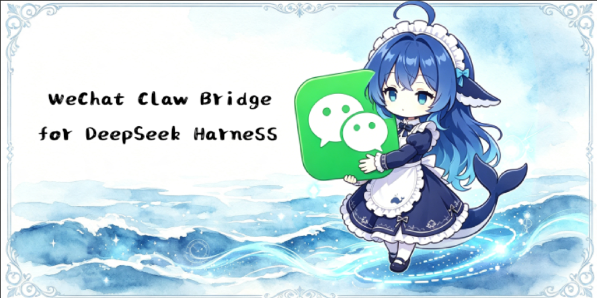

# dsh-plugin-wechat-bridge

> **Language**：[中文](./README.md) ｜ **English**

DSH (DeepSeek Harness) bundle plugin that bridges **WeChat (ilink bot)** private-chat
messages into a DSH agent session and streams the reply back as plain text — with
**runtime enable/disable hot-plug** (no `dsh web` restart required).

> A [DeepSeek Harness](https://github.com/deepseek-ai/deepseek-harness) plugin:
> install into the `web` profile, scan a QR code to bind a WeChat bot account,
> and chat with your DSH agent from WeChat. One session per peer per day,
> durable JSON-file state, crash-safe polling.

Ported from CodePilot's WeChat bridge subsystem (`src/lib/bridge/adapters/weixin/*`),
self-contained for DSH (JSON-file persistence instead of SQLite, no OpenClaw runtime dep).

## Highlights

- **Hot plug** — enable/disable live from the Settings UI tab, the `/wechat`
  slash command, or `settings.yaml`; no process restart.
- **One session per peer per day** — local-midnight rotation, lazily created on
  the first message, titled `<YYYY-MM-DD>`.
- **Crash-safe by construction** — cross-process poll lock, per-chat
  serialization, inbound message dedupe, corrupt-log quarantine and self-heal.
- **Self-contained** — accounts, tokens, and poll offsets persist in a single
  atomic JSON file; no database required.
- **Settings UI tab** — bind accounts by QR code and manage them from the
  browser, no config editing needed.

## What it does

- Polls the WeChat `ilink bot` API (`getupdates`) per configured account (multi-account).
- **One session per peer per calendar day (this machine's timezone).** The first inbound
  message after local midnight lazily creates that day's session, titled
  `<YYYY-MM-DD>`; a day with no conversation never materializes a session.
  A corrupt log from a previous day therefore can never block today's conversation.
- Sessions live under `~/.dsh/wechat-bridge/WeChatSpace` by default (not the process cwd).
- Per-chat serialization: messages for the same peer are driven strictly one at a time,
  so concurrent inbound messages cannot interleave writes into one session log.
- **Cross-process poll lock** (`~/.dsh/wechat-bridge/poll.lock`): only one DSH
  process polls WeChat accounts at a time; a second process sees the live lock
  and waits, so a launchd keep-alive instance racing a manual restart cannot
  double-poll and interleave writes into the same session log.
- **Inbound dedupe**: each WeChat `message_id` (fallback: server `seq`) is
  recorded as processed before driving the agent, so a re-delivered batch
  (crash before offset persist, or a second process) is skipped.
- **Corrupt-log self-heal**: if a session's stored log fails both resume and
  create ("already exists"), the artifact is quarantined as
  `session.jsonl.zstd.corrupt-<ts>` and a fresh same-day session is created,
  so one bad log cannot fail every message of the day.
- Sends the agent's reply back to WeChat as plain-text chunks (4096 chars × max 5).
- **Context injection**: the day's session is created with the user-global
  `~/.dsh/AGENTS.md` and the available skill catalog (`<available_skills>`)
  injected up front — the same context a GUI session receives.
- **Inbound media**: images/files/videos/voice sent from WeChat are downloaded
  from the CDN, AES-decrypted, parked under `WeChatSpace/inbox/<date>/`, and
  described by path in the message; when the selected model declares image
  input, images are also attached as native image content.
- **Outbound media**: the agent can call the `wechat_send_file` tool to upload
  a locally generated image/video/file to the WeChat CDN and send it to the
  current peer (routed by extension, optional text caption).
- Stores `context_token` per peer so it can reply after restarts (WeChat requires it).
- Pauses an account for 60 min on `errcode -14` (session expired).
- Migrates pre-rename state automatically: the `~/.dsh/weixin-bridge` data directory
  and the `weixin-bridge:` settings section are renamed once to their `wechat-*` names.

## Install (into the `web` profile)

One-line install:

```bash
dsh plugin --profile web add github:NattoCB/dsh-plugin-wechat-bridge
```

Manual install steps follow.

> Prereq: the harness resolves bundle deps from the flat `~/.dsh/profiles/node_modules`
> fallback, so **do not** symlink the package from outside the profile tree for ESM —
> copy it under the profile. (A `file:` dependency + `dsh.profile.bundles` entry is the
> canonical registration; the copy is the booted artifact.)

```bash
# 1. copy the plugin under the web profile's node_modules
#    (keep vendored deps: qrcode/pngjs/dijkstrajs live in the plugin's own node_modules)
SRC=/path/to/dsh-plugin-wechat-bridge
DST=~/.dsh/profiles/web/node_modules/dsh-plugin-wechat-bridge
rm -rf "$DST" && cp -R "$SRC" "$DST"

# 2. register in the profile manifest (~/.dsh/profiles/web/package.json)
#    dependencies: add  "dsh-plugin-wechat-bridge": "file:<SRC>"
#    dsh.profile.bundles: add "dsh-plugin-wechat-bridge"

# 3. (re)start dsh web — the bundle patch mounts the `wechat-bridge` service
#    and serves the client settings tab at /plugins/<id>/client.js.
dsh web
```

The service mounts at boot; if `settings.wechat-bridge.enabled` is true it starts polling
immediately. Otherwise it idles until enabled (see below).

## Settings UI tab (recommended)

Open **Settings → "微信桥接" (WeChat bridge)** in the bottom-left of the DSH web UI:

- **Status card**: bridge running state + enable/disable button (hot-plug, effective immediately, no restart).
- **Default model card**: two dropdowns pick the provider/model used by bridged
  sessions (options come from DSH's registered models, no free-text input);
  leave empty to follow the global default, saved to settings.yaml.
- **Accounts card**: bound account list (account id, token status, last login time) + remove button.
- **QR bind**: click "扫码绑定账号" (bind account) → a QR code renders inline (PNG data URL) →
  scan status auto-polls every 2 seconds → once confirmed in WeChat, the account is saved and the bridge enabled.

## Runtime enable / disable (hot-plug)

Three independent controls, all live without restart:

1. **Settings UI tab** (above).

2. **Slash command** (in any DSH chat):
   - `/wechat status` — running? account count?
   - `/wechat enable` — start the poll loop now (also writes `settings.wechat-bridge.enabled=true`)
   - `/wechat disable` — stop the poll loop now (writes `settings.wechat-bridge.enabled=false`)
   - `/wechat accounts` — list configured accounts
   - `/wechat qrlogin` — start a QR login; returns a `sessionId`
   - `/wechat qrstatus <sessionId>` — poll scan status; on `confirmed` saves the account and enables
   - `/wechat rm <accountId>` — remove an account

3. **Settings flag** (hot-reloaded): edit `~/.dsh/settings.yaml`:
   ```yaml
   wechat-bridge:
     enabled: true        # live toggle; the service re-applies on every change
     mediaEnabled: true
     defaultProvider: '' # bridged-session provider (empty = follow global default)
     defaultModel: ''     # bridged-session model (empty = follow global default)
   ```
   Changing `enabled` and saving re-reads the flag and starts/stops the loop.

The UI tab calls the plugin's own HTTP API (`/wechat-bridge/*`) served by the host
webserver — no external service involved.

## Configuration (plugin `config` in cordis.patch.yml)

| key | default | meaning |
|---|---|---|
| `enabled` | `false` | boot-time autostart if settings flag absent |
| `mediaEnabled` | `true` | (reserved) attach inbound media |
| `dataDir` | `~/.dsh/wechat-bridge` | where `state.json` (accounts/tokens/offsets) lives |
| `defaultModel` | `''` | override model for bridged sessions (else global default; selectable in the settings tab) |
| `defaultProvider` | `''` | override provider for bridged sessions (else global default; selectable in the settings tab) |
| `defaultCwd` | `''` | working dir for new sessions (else `~/.dsh/wechat-bridge/WeChatSpace`) |

## Files

```
src/index.js        WechatBridgeService: poll loop, agent-driving, per-day sessions,
                    hot-plug, /wechat command, + /wechat-bridge/* HTTP API for the
                    settings tab (QR rendered server-side)
client/client.js    Client bundle: registers the Settings「微信桥接」section slot (React)
src/weixin-api.js   ilink bot protocol client (getupdates/sendmessage/sendtyping/getconfig/qrlogin)
src/weixin-ids.js   synthetic chatId encode/decode (weixin::<accountId>::<peerUserId>)
src/weixin-types.js protocol enums/constants
src/store.js        JSON-file persistence (accounts, context_tokens, offsets; legacy-dir migration)
cordis.patch.yml    bundle patch (registers service `wechat-bridge`)
package.json        declares dsh.bundle + dsh.client (web)
node_modules/       vendored qrcode/pngjs/dijkstrajs (QR data-URL rendering, no pnpm needed)
```

## Session model

- Session id: `wechat-<chatId>-<YYYY-MM-DD>` (local machine timezone, e.g. `2026-08-15`).
- Created lazily on the first inbound message of the day; never pre-created at midnight.
- Title: `<YYYY-MM-DD>`, pinned with the `user` title source so automatic
  title generation never overwrites it.
- Default cwd: `~/.dsh/wechat-bridge/WeChatSpace` (created on boot; override with `defaultCwd`).
- Peer identity stays encoded as `weixin::<accountId>::<peerUserId>` (protocol layer,
  shared with CodePilot lineage); only the plugin's own naming uses `wechat-*`.

## Notes / scope

- Outbound media is agent-initiated via the `wechat_send_file` tool; inbound
  voice is parked on disk only (no transcription).
- Private chat only; no group semantics.
- Requires a WeChat account with `ilink bot` permission (`bot_type=3`).
- Persistence is a single atomic JSON file (`state.json`) — sufficient for one DSH process.
- The per-chat queue serializes within one process; the cross-process poll lock and
  message dedupe cover the multi-process case (keep the port single-owned anyway).
